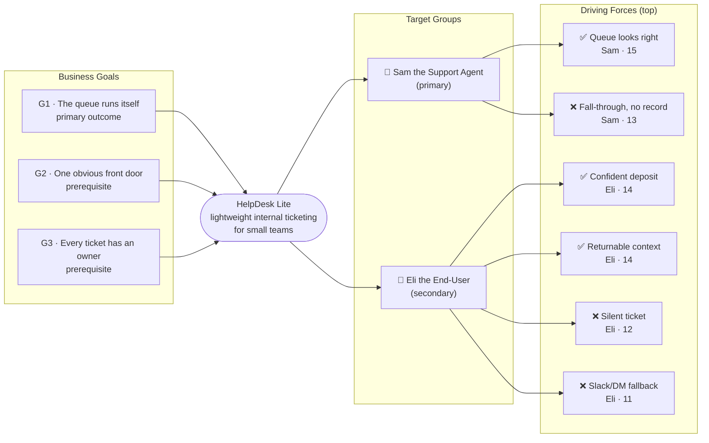

# Trigger Map — HelpDesk Lite

> Phase 2 — Trigger Mapping
> Source: Workshops 1–3, `design-process/A-Product-Brief/product-brief.md`
> Status: Draft — pending review

---

## The Map

---

## Business Goals

| Goal | Vision | Key Objectives |
|------|--------|----------------|
| **G1** | The queue runs itself | Resolution latency < 2 days · Reopen rate < 15% · Queue hygiene (no orphans > 14d) |
| **G2** | One obvious front door | Adoption ≥ 80% in 90d · Front-door satisfaction ≥ 85% · Channel collapse (TBD method) |
| **G3** | Every ticket has an owner | Ownership visibility ≥ 95% · Handover integrity 100% · Requester-side clarity ≥ 80% |

→ Full detail: [01-business-goals.md](01-business-goals.md)

---

## Target Groups

| Priority | Persona | Goals served | Persona page |
|----------|---------|--------------|--------------|
| 👥 Primary | Sam the Support Agent | G1, G3 | [02-persona-sam-the-support-agent.md](02-persona-sam-the-support-agent.md) |
| 👤 Secondary | Eli the End-User | G1, G2, G3 | [03-persona-eli-the-end-user.md](03-persona-eli-the-end-user.md) |

Admin is a permission overlay on the Support Agent role, not a separate persona.

---

## Driving Forces — Priority Summary

Sorted by FIA score (Frequency + Intensity + Fit /15). Scores ≥ 13 are high-priority design inputs.

| Score | Force | Group | Direction |
|-------|-------|-------|-----------|
| **15** | The queue looks right | Sam | ✅ Positive |
| **14** | Confident deposit | Eli | ✅ Positive |
| **14** | Returnable context | Eli | ✅ Positive |
| **14** | Nothing falls through | Sam | ✅ Positive |
| **13** | A request falls through with no record | Sam | ❌ Negative |
| **13** | Ownership ambiguity | Sam | ❌ Negative |
| **13** | Visible traction | Eli | ✅ Positive |
| **12** | My work is traceable | Sam | ✅ Positive |
| **12** | Silent ticket | Eli | ❌ Negative |
| **11** | Closure that's real | Eli | ✅ Positive |
| **11** | Explaining the problem twice | Eli | ❌ Negative |
| **11** | Falling back to Slack/DM to chase | Eli | ❌ Negative |
| **10** | The queue becomes a dumping ground | Sam | ❌ Negative |
| **10** | Resolving something that wasn't actually fixed | Sam | ❌ Negative |

**Key read:** Sam's top force (queue looks right, 15) is the single highest-scoring driver in the map — the design priority is clear: the Agent Dashboard must answer Sam's morning scan questions in seconds. Eli's top forces (confident deposit + returnable context, both 14) cluster around the *trust in the loop*: the request must feel received, and it must remain returnable days later. The most important *negative* force is Eli's silent ticket (12) and the resulting Slack fallback (11) — together they describe the exact adoption failure mode Goal 2 measures. **The product's strategic center of gravity is "no silent tickets, no Slack fallbacks"** — the whole queue-runs-itself promise collapses from Eli's side if those two are not prevented.

---

_Produced by Saga — 2026-09-14_
_Source: 01-business-goals.md, 02-persona-sam-the-support-agent.md, 03-persona-eli-the-end-user.md_
